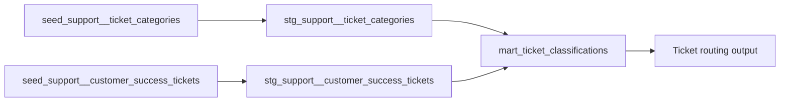

# BigQuery AI.CLASSIFY dbt Demo

This dbt project shows a minimal pattern for classifying customer success
tickets in BigQuery with `AI.CLASSIFY`.

## What this demo contains

- `seed_support__ticket_categories`: five seeded ticket categories with
  human-readable descriptions
- `seed_support__customer_success_tickets`: sample customer success tickets
- `stg_support__ticket_categories`: staging model for explicit casting
- `stg_support__customer_success_tickets`: staging model for explicit
  casting
- `mart_ticket_classifications`: final model that calls
  `AI.CLASSIFY(ticket_description, categories => ...)`

## Project structure

```text
seeds/
  seed_support__ticket_categories.csv
  seed_support__customer_success_tickets.csv
models/
  staging/support/
  datamart/support/
```

## Required environment variables

The project uses a repo-local `profiles.yml` backed by `.env`.

Required:

- `DBT_BIGQUERY_PROJECT`
- `DBT_BIGQUERY_DATASET`
- `DBT_BIGQUERY_LOCATION`

Optional:

- `BIGQUERY_AI_CONNECTION_ID`
- `BIGQUERY_AI_ENDPOINT`

If `BIGQUERY_AI_CONNECTION_ID` is not set, `AI.CLASSIFY` uses BigQuery
end-user credentials as documented by Google Cloud.

## Setup

```bash
cp .env.example .env
./dbtw debug
```

## Run the demo

```bash
./dbtw seed
./dbtw build -s +mart_ticket_classifications
```

## Exact demo flow

Run the project from the `bigquery_ai_classify_demo/` directory:

```bash
cp .env.example .env
./dbtw debug
./dbtw seed
./dbtw build -s +mart_ticket_classifications
```

Inspect the final model:

```bash
./dbtw show --inline "select * from {{ ref('mart_ticket_classifications') }}" --limit 10
```

This flow keeps the demo minimal:

- `dbtw debug` validates the local profile and BigQuery connection
- `dbtw seed` creates the two input tables
- `dbtw build -s +mart_ticket_classifications` builds the upstream staging
  models and the final classification model in one command
- `dbtw show --inline` previews the built result table

## Results

The examples below come from these `dbt show` commands:

```bash
./dbtw show -s seed_support__ticket_categories --limit 5 --output json
./dbtw show -s seed_support__customer_success_tickets --limit 10 --output json
./dbtw show --inline "select * from {{ ref('mart_ticket_classifications') }}" --limit 10 --output json
```

### Data flow



### Example seed rows

`seed_support__ticket_categories`

| category_id | category_name                  | category_description                                                                     |
| ----------- | ------------------------------ | ---------------------------------------------------------------------------------------- |
| 1           | Billing and Invoicing          | Questions about invoices payments refunds plan changes or billing errors.                |
| 2           | Technical Troubleshooting      | Requests where the product is not working as expected and needs technical investigation. |
| 3           | Feature Request                | Ideas for new product capabilities workflow improvements or enhancements.                |
| 4           | Account Access and Permissions | Issues related to login access roles user invites or permission changes.                 |
| 5           | Needs Triage                   | Tickets that do not clearly fit another category and should be reviewed manually.        |

`seed_support__customer_success_tickets`

| ticket_id | ticket_description                                                                                |
| --------- | ------------------------------------------------------------------------------------------------- |
| 1001      | Our latest invoice looks too high because two seats were billed twice after we upgraded the plan. |
| 1002      | The dashboard times out every time I apply a date filter for the last 90 days.                    |
| 1003      | It would be helpful if we could schedule a weekly export of account health metrics to email.      |
| 1004      | One of our new teammates cannot log in and the invite link says it has expired.                   |
| 1005      | Can you change our contract to annual billing and let me know how the discount would work.        |

### Example result rows

`mart_ticket_classifications`

| ticket_id | ... | predicted_category_name        | category_id | category_name                  |
| --------- | --- | ------------------------------ | ----------- | ------------------------------ |
| 1001      | ... | Billing and Invoicing          | 1           | Billing and Invoicing          |
| 1002      | ... | Technical Troubleshooting      | 2           | Technical Troubleshooting      |
| 1003      | ... | Feature Request                | 3           | Feature Request                |
| 1004      | ... | Account Access and Permissions | 4           | Account Access and Permissions |
| 1005      | ... | Billing and Invoicing          | 1           | Billing and Invoicing          |
| 1006      | ... | Technical Troubleshooting      | 2           | Technical Troubleshooting      |
| 1007      | ... | Feature Request                | 3           | Feature Request                |
| 1008      | ... | Account Access and Permissions | 4           | Account Access and Permissions |
| 1009      | ... | Technical Troubleshooting      | 2           | Technical Troubleshooting      |
| 1010      | ... | Needs Triage                   | 5           | Needs Triage                   |

### Essential mart transformation

The key step is the compiled `AI.CLASSIFY` call in
`mart_ticket_classifications`. BigQuery receives the ticket description
and a literal array of category labels plus descriptions, then the result
is joined back to the category seed.

Compiled SQL excerpt:

```sql
classified_tickets as (

    select
        customer_success_tickets.ticket_id
        , customer_success_tickets.ticket_description
        , ai.classify(
            customer_success_tickets.ticket_description
            , categories => [
                struct(
                    'Billing and Invoicing' as label
                    , 'Questions about invoices payments refunds plan changes or billing errors.' as description
                ),
                struct(
                    'Technical Troubleshooting' as label
                    , 'Requests where the product is not working as expected and needs technical investigation.' as description
                ),
                struct(
                    'Feature Request' as label
                    , 'Ideas for new product capabilities workflow improvements or enhancements.' as description
                ),
                struct(
                    'Account Access and Permissions' as label
                    , 'Issues related to login access roles user invites or permission changes.' as description
                ),
                struct(
                    'Needs Triage' as label
                    , 'Tickets that do not clearly fit another category and should be reviewed manually.' as description
                )
            ]
        ) as predicted_category_name
    from customer_success_tickets

),

final as (

    select
        classified_tickets.ticket_id
        , classified_tickets.ticket_description
        , classified_tickets.predicted_category_name
        , ticket_categories.category_id
        , ticket_categories.category_name
        , ticket_categories.category_description
    from classified_tickets
    left join ticket_categories
        on classified_tickets.predicted_category_name = ticket_categories.category_name

)
```

## How classification works

The final model builds an array of category labels and descriptions from
the demo category set and passes that literal array into `AI.CLASSIFY`.
This is necessary because BigQuery requires the `categories` argument to
be a literal or query parameter. The predicted category label is then
joined back to the seeded category table so the final output includes
both the classification result and the underlying category metadata.

## Output

The final model returns one row per ticket with:

- `ticket_id`
- `ticket_description`
- `predicted_category_name`
- `category_id`
- `category_name`
- `category_description`
